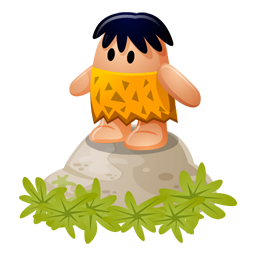

#  Primal [](http://travis-ci.org/whiskeysierra/primal)

A **Pr**ocess **Ma**nagement **L**ibrary for the Java Platform

**This library is still under development**

## Requirements

- Java 1.6 or higher
- Guava 14.x

## Installation

### Gradle/Maven/Ivy

### Jar

## Usage

```java
Primal.call("brew", "update");
```

```java
final String uptime = Primal.read("uptime");
```

```java
final Path python = Paths.get("/path/to/executable");

final ManagedProcess managed = Primal.prepare(python);
managed.parameterize("--option", "some", "arguments");
final RunningProcess process = managed.call();

// write to stdin
Files.copy(input, process.getOutput());
// read from stdout
Files.copy(process.getInput(), output);

process.await();
```

## Design Goals

### Mockability
API is pure interface-based...

```java
@Test
public void test() {
    final ProcessService service = EasyMock.createNiceMock(ProcessService.class);
    final ManagedProcess managed = EasyMock.createNiceMock(ManagedProcess.class);
    final RunningProcess process = EasyMock.createNiceMock(RunningProcess.class);

    EasyMock.expect(service.prepare("/path/to/executable")).andReturn(managed);
    EasyMock.expect(managed.call()).andReturn(process);

    final InputStream stdout = createFakeStdout();
    EasyMock.expect(process.getInput()).andReturn(stdout);
    EasyMock.expect(process.waitFor()).andReturn(0);

    EasyMock.replay(service, managed, process);

    final ExampleService unit = new ExampleService(service);
    unit.run();

    EasyMock.verify(service, managed, process);
}
```

### Support for Dependency Injection

#### Guice or Dagger

Inside your [Module](http://google-guice.googlecode.com/git/javadoc/com/google/inject/Module.html) or
[@Module](http://square.github.io/dagger/javadoc/dagger/Module.html) respectively:
```java
@Provides
public ProcessService provideProcessService() {
    return Primal.createService();
}
```

## Attributions
Caveman Icon by [Fast Icon](http://www.iconarchive.com/show/dino-icons-by-fasticon/Caveman-rock-2-icon.html) 
is licensed as Linkware: [Icons by: Fast Icon.com](http://www.fasticon.com/)
