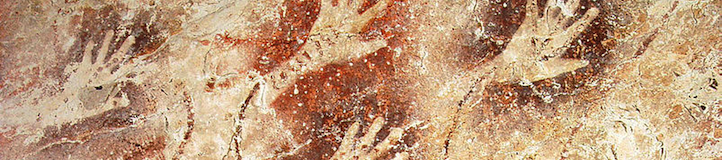

#  Primal [](http://travis-ci.org/whiskeysierra/primal)



A **Pr**ocess **Ma**nagement **L**ibrary for the Java Platform

**This library is still under development**

## Requirements

- Java 1.6 or higher

## Installation

## Usage

```java
final Path python = Paths.get("/usr/bin/python");

final ManagedProcess managed = Primal.prepare(python);
managed.parameterize("-c", "print 'Hello from Python'");
final RunningProcess process = managed.call();

// write to stdin
Files.copy(input, process);
// read from stdout
Files.copy(process, output);

process.await();
```

## Attributions
Caveman Icon by [Fast Icon](http://www.iconarchive.com/show/dino-icons-by-fasticon/Caveman-rock-2-icon.html) 
is licensed as Linkware: [Icons by: Fast Icon.com](http://www.fasticon.com/)


The cave painting photo from [Wikimedia Commons](https://en.wikipedia.org/wiki/File:GuaTewet_tree_of_life-LHFage.jpg) is made
available under the
[CC0 1.0 Universal (CC0 1.0) Public Domain Dedication](https://creativecommons.org/publicdomain/zero/1.0/deed.en).


